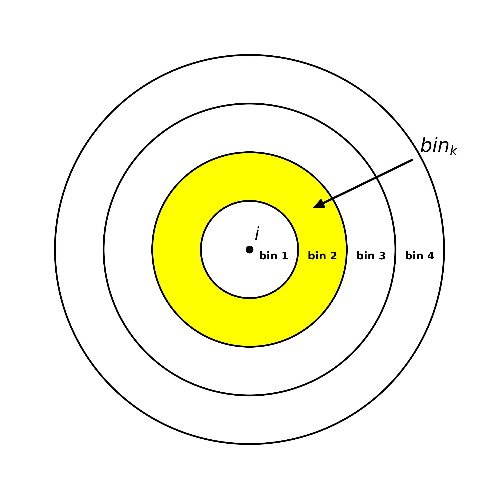
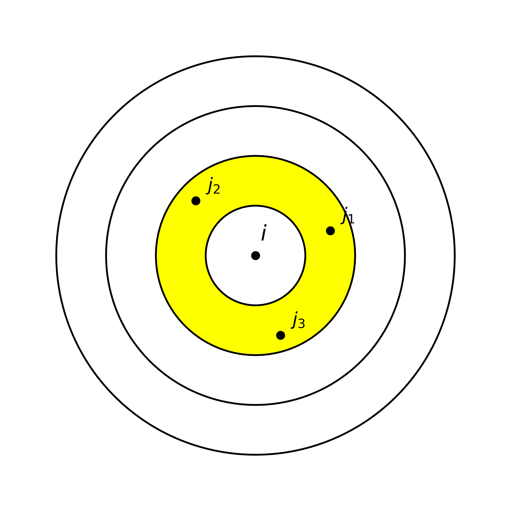

# 1. Title (Tiêu đề)
Sử dụng mô hình dựa trên phân bổ xác suất di chuyển để ước lượng luồng di chuyển tại các thành phố lớn: Singapore, Seoul
# 2. Abstract
Dữ liệu luồng di chuyển đô thị đóng vai trò then chốt trong quy hoạch giao thông và dự báo dịch bệnh. Tuy nhiên, các mô hình truyền thống thường gặp hạn chế trong việc cân bằng giữa tính linh hoạt và độ chính xác trên các cấu trúc đô thị đa dạng. Nghiên cứu đề xuất phương pháp **Scale-Dependent Mobility Law (Shell Model)** dựa trên phân bổ xác suất di chuyển rời rạc kết hợp với trọng số hấp dẫn từ dữ liệu mở OpenStreetMap. Thực nghiệm trên 52 thành phố (Seoul, Singapore và 50 đô thị Hoa Kỳ) cho thấy mô hình đề xuất đạt độ chính xác vượt trội với chỉ số CPC trung bình từ **0.70 đến 0.84**, cao hơn hẳn các mô hình tham số. Kết quả này thiết lập một khung dự báo phi tham số, có khả năng chuyển giao cao cho các đô thị thiếu hụt dữ liệu khảo sát.
# 3. Introduction
Các mô hình tương tác không gian truyền thống như Gravity và Radiation từ lâu đã được áp dụng rộng rãi để ước lượng luồng di chuyển (mobility flows) và mang lại nhiều kết quả quan trọng trong quản lý đô thị, dự báo dịch bệnh. Tuy nhiên, khả năng dự báo của các mô hình này vẫn có những giới hạn chưa thể sử dụng hiệu quả cho mọi loại hình đô thị.

Cụ thể, mô hình Gravity gặp trở ngại lớn do các tham số suy giảm khoảng cách phụ thuộc chặt chẽ vào dữ liệu lịch sử, khiến nó mất đi tính linh hoạt khi áp dụng cho các khu vực thiếu dữ liệu quan sát [5,12]. Ngược lại, mô hình Radiation dù có lợi thế không tham số (parameter-free) nhưng lại dựa trên giả định đơn điệu về việc tối ưu hóa khoảng cách để tìm kiếm cơ hội [12,8]. Giả định này không còn phù hợp trong bối cảnh các đô thị hiện đại, nơi sự phân bổ dày đặc của các điểm tiện ích (Points of Interest - POIs) thúc đẩy các hành vi di chuyển vượt ra ngoài quy luật "gần nhất" để thỏa mãn các nhu cầu dịch vụ đa dạng [8].

Với sự phát triển của ngành học máy, học máy sâu, nhiều nghiên cứu gần đây đã chuyển hướng sang các giải pháp dựa trên dữ liệu (Data-driven), kết hợp dữ liệu mở từ OpenStreetMap hoặc ảnh vệ tinh để hiểu cấu trúc không gian chính xác hơn [5,7]. Mặc dù cải thiện đáng kể độ chính xác, nhưng các phương pháp này vẫn đòi hỏi tài nguyên tính toán, dữ liệu huấn luyện đa chiều [5,9]. Để giảm đi số chiều dữ liệu cần dùng, nghiên cứu của Atwal đã chỉ ra việc sử dụng dữ liệu mở với số chiều dữ liệu chỉ 9 thuộc tính ít hơn dữ liệu thực thể 65 nhưng vẫn giải thích được luồng di chuyển và phương pháp này có tính chuyển giao [11]. Điều này giúp tiết kiệm tính toán của học máy đồng thời có tính mở rộng khi áp dụng cho các đô thị khác nhau.

Nghiên cứu của chúng tôi đề xuất một hướng tiếp cận mới có thể khắc phục các điểm yếu trên thông qua một mô hình không tham số như mô hình Radiation, sử dụng hàm phân bổ xác suất di chuyển có điều kiện thay cho hàm suy giảm khoảng cách, và cần dữ liệu ít chiều hơn các mô hình học máy. Cụ thể mô hình đề xuất sử dụng khung xác suất di chuyển có điều kiện (conditional mobility probability) tại các vùng quan sát kết hợp với dữ liệu mở của OSM như: POI để phục hồi ma trận Origin-Destination (OD). Bằng cách áp dụng ràng buộc đầu ra (Production-constrained)[1], mô hình cho thấy điểm vượt trội so với các mô hình truyền thống tại các thành phố như Singapore và Seoul.

# 4. Methodology
Nghiên cứu đề xuất một khung phương pháp luận mới dựa trên sự kết hợp giữa phân bổ xác suất khoảng cách rời rạc và trọng số hấp dẫn từ tiện ích đô thị (POI).

## 4.1 Notation and Nomenclature (Ký hiệu và thuật ngữ)
Để đảm bảo tính thống nhất trong việc so sánh 6 mô hình, các ký hiệu toán học được quy ước như sau:

| Ký hiệu | Ý nghĩa | Ghi chú |
| :--- | :--- | :--- |
| $i, j$ | Các đơn vị phân vùng đô thị | subzones / tracts |
| $T_{ij}$ | Số lượng thực tế chuyến đi từ $i$ đến $j$ | Số lượng chuyến đi thực tế |
| $\hat{T}_{ij}$ | Số lượng chuyến ước lượng từ $i$ đến $j$ | Số lượng chuyến đi dự báo |
| $O_i$ | Tổng lưu lượng xuất phát từ $i$ | $\sum_j T_{ij}$ (Sản lượng - Production) |
| $r_{ij}$ | Khoảng cách Euclidean ($i \rightarrow j$) | Tính dựa trên tâm hình học (Centroid) |
| $m_i, n_j$ | Quy mô dân số tại vùng $i$ và $j$ | Dữ liệu từ WorldPop/Tiff 1km |
| $s_{ij}$ | Cơ hội xen giữa (Intervening Opportunities) | Số lượng dân số trong bán kính $r_{ij}$ |
| $B_j$ | Tổng số POI của vùng đích $j$ | Lấy từ dữ liệu OpenStreetMap |
| $D_j$ | Sức hấp dẫn của vùng đích $j$ | Đại diện bởi dân số ($n_j$) hoặc POI ($B_j$) |
| $A_i$ | Hệ số cân bằng (Balancing Factor) | Đảm bảo ràng buộc điểm nguồn: $\sum_j \hat{T}_{ij} = O_i$ |
| $\text{bin}_k$ | Dải khoảng cách thứ $k$ | Độ phân giải 1km |
| $P(bin_k\|i)$ | Xác suất di chuyển vào $bin_k$ từ gốc $i$ | Xác suất thực nghiệm rời rạc |
| $\alpha, \beta, \gamma$ | Các tham số hiệu chỉnh | Tham số mô hình Gravity / Radiation |

## 4.2 Baseline 1: Gravity Models (Mô hình Trọng trường)
Mô hình Gravity giả định luồng di chuyển tỷ lệ thuận với quy mô dân số và tỷ lệ nghịch với khoảng cách.

### Công thức tổng quát (Production-Constrained):
$$ \hat{T}_{ij} = A_i O_i D_j f(r_{ij}) $$

Trong đó $f(r_{ij})$ là hàm suy giảm khoảng cách (thường là $r_{ij}^{-\gamma}$ hoặc $e^{-\gamma r_{ij}}$). Hệ số $A_i = [\sum_j D_j f(r_{ij})]^{-1}$ giúp duy trì ràng buộc sản lượng tại điểm xuất phát.

### Ví dụ minh họa [12]:
Xét hai cặp địa điểm có đặc điểm dân số và khoảng cách tương đồng để đánh giá độ nhạy của mô hình:

*   **Cặp 1 (Bang Utah - UT):**
    - Điểm gốc (Davis County): $m_i = 90,000$ người.
    - Điểm đích (Washington County): $n_j = 240,000$ người.
    - Khoảng cách: $r_{ij} = 447$ km.
*   **Cặp 2 (Bang Alabama - AL):**
    - Điểm gốc (Madison County): $m_i = 89,000$ người.
    - Điểm đích (Houston County): $n_j = 280,000$ người.
    - Khoảng cách: $r_{ij} = 410$ km.

**Tham số mô hình:**
Tham số ước lượng cho mô hình gravity
$$[\alpha, \beta, \gamma] = \begin{cases}    [0.30, 0.64, 3.05] & \text{ khi } r > 119 \text{ km}, \\
                            [0.24, 0.14, 0.29] & \text{ khi } r < 119 \text{ km} \end{cases}$$
Dựa vào khoảng cách giữa điểm gốc và điểm đích $r > 119$ km, bộ tham số tối ưu được xác định như sau:
- $\alpha = 0.24$
- $\beta = 0.14$
- $f(r_{ij}) = r_{ij}^{\gamma}$ với $\gamma = 0.29$

**Quy trình tính toán:**
Thay các giá trị thực tế vào công thức tỷ lệ:
- Ước lượng luồng di chuyển tại Utah:
  
$$ \hat{T}_{UT} = \frac{90.000^{0.24} \times 240.000^{0.14}}{447^{0.29}} = 1.08 \text{ di chuyển} $$
- Ước lượng luồng di chuyển tại Alabama:
  
$$ \hat{T}_{AL} = \frac{89.000^{0.24} \times 280.000^{0.14}}{410^{0.29}} = 1.12 \text{ di chuyển} $$

## 4.3 Baseline 2: Radiation Model (Mô hình Bức xạ)
Mô hình Radiation dựa trên lý thuyết về các cơ hội xen giữa, không yêu cầu các tham số ước lượng từ dữ liệu lịch sử.

### Công thức tổng quát:
$$ \hat{T}_{ij} = O_i \times \frac{m_i \times n_j}{(m_i + s_{ij}) \times (m_i + n_j + s_{ij})} $$

Các ký hiệu và ý nghĩa biến số tương tự quy ước tại mục 4.1.

### Ví dụ minh họa:

Theo thống kê thì $O_i = 0.11 \times m_i$

**Trường hợp 1: Bang Utah**
- Dân số gốc (Davis County): $m_i$ = 90.000
- Dân số đích (Washington County): $n_j$ = 240.000
- Dân số xen giữa: $s_{ij}$ = $2 \times 10^6$ 
- Tổng lượng di chuyển từ điểm nguồn: $O_i = 0.11 \times 90,000 = 9,900$

- Xác suất chọn điểm đến $P_{UT}$:    
$$P_{UT} = \frac{90,000 \times 240,000}{(90,000 + 2,000,000) \times (90,000 + 240,000 + 2,000,000)} \approx 0.00443$$

Dự báo luồng di chuyển tại Utah: $\hat{T}_{UT} = 9,900 \times 0.00443 \approx 43.9$ di chuyển.

**Trường hợp 2: Bang Alabama**
- Dân số gốc (Madison County): $m_i$ = 89,000 người
- Dân số đích (Houston County): $n_j$ = 280,000 người
- Dân số xen giữa: $s_{ij}$ = $2 \times 10^7$ người
- Tổng lượng di chuyển từ điểm nguồn: $O_i = 0.11 \times 89,000 = 9,790$ người.

- Xác suất chọn điểm đến $P_{AL}$ :
$$P_{AL} = \frac{m_i \times n_j}{(m_i + s_{ij}) \times (m_i + n_j + s_{ij})} = \frac{89,000 \times 280,000}{(89,000 + 20,000,000) \times (89,000 + 280,000 + 20,000,000)} \approx 0.00006$$

Dự báo luồng di chuyển tại Alabama: $ \hat{T}_{AL} = 9,790 \times 0.00006 \approx 0.59 \text{ di chuyển} $

**Kết quả**:
- Dữ liệu thực tế quan sát được:
    $T_{UT} = 44 \text{ di chuyển} $ 
    $T_{AL} = 6 \text{ di chuyển}$
- Điều này cho thấy mô hình radiation có thể phản ánh được quy mô dân số và cơ hội xen giữa của các vùng - ảnh hưởng của không gian lân cận, tránh được việc bị phụ thuộc quá mức vào chỉ số khoảng cách. Nhờ đó cho kết quả tốt hơn mô hình gravity trong trường hợp này.

## 4.4 Probability Distribution of Trip Lengths

Với mỗi vùng $i$, ta xác định khoảng cách với các vùng $j$ còn lại. Sau đó, các vùng $j$ được gom vào các dải khoảng cách $bin_k$ dựa trên khoảng cách từ vùng $i$ đến vùng $j$. Độ rộng mỗi $bin_k$ được chọn là 1km để số lượng bin không quá lớn tránh tình trạng có quá nhiều bin không có dữ liệu làm sai lệch thống kê. 

Ví dụ: 
- Cặp di chuyển có bán kính $r_{ij}$ = 1.1 km thì thuộc $bin_1$
- Cặp di chuyển có bán kính $r_{ij}$ = 2.1 km thì thuộc $bin_2$
- Cặp di chuyển có bán kính $r_{ij}$ = 3.1 km thì thuộc $bin_3$

### 4.4.1 Mục tiêu kiểm chứng (Verification Goal)
Việc xác định $P(\text{bin}_k|i)$ trong nghiên cứu này đóng vai trò như một bước **kiểm chứng thực nghiệm (Validation)**. Mục tiêu chưa phải là dự báo luồng di chuyển cho các khu vực thiếu thông tin, mà là để chứng minh giả thuyết: *Nếu ta có thể nắm bắt được quy luật phân bổ xác suất di chuyển của một người khi biết vị trí hiện tại đến điểm đích, liệu ta có thể tái tạo (reconstruct) chính xác ma trận OD thực tế bằng cách kết hợp nó với dữ liệu POI hay không?*

Xác suất này được tính toán trực tiếp từ dữ liệu quan sát để thiết lập một "giới hạn trên" về độ chính xác mà mô hình có thể đạt được khi tích hợp đầy đủ thông tin về khoảng cách và lực hấp dẫn đô thị.

**Ví dụ minh họa quy trình tái tạo:**
- Với xác suất $P(bin_1|i) = 0.2$.
- Nếu điểm nguồn $i$ có tổng lưu lượng $O_i = 1000$ chuyến, mô hình sẽ kiểm chứng xem việc phân bổ 200 chuyến đi ($1000 \times 0.2$) vào các vùng đích trong dải $bin_1$ dựa trên trọng số POI có khớp với thực tế hay không.
- Quá trình này được thực hiện lặp lại cho toàn bộ các dải khoảng cách để tái tạo lại cấu trúc di chuyển của toàn thành phố.

### 4.4.2 Cách xác định xác suất thực nghiệm
$$ P(\text{bin}_k|i) = \frac{\sum_{j \in \text{bin}_k} T_{ij}}{\sum_{j} T_{ij}} = \frac{\sum_{j \in \text{bin}_k} T_{ij}}{O_i}  $$

**Ví dụ về cách xác định xác suất:**
- Giả sử tại một vùng $i$ cụ thể có tổng số lượng di chuyển là $10.000$ chuyến ($O_i = 10.000$).
- Số lượng chuyến đi thực tế quan sát được từ $i$ đến các vùng đích trong dải khoảng cách 1-2km ($bin_1$) là $2.000$ chuyến.
- Khi đó, xác suất thực nghiệm có điều kiện cho dải $bin_1$ là: $P(bin_1|i) = 2.000 / 10.000 = 0.2$.
- Số lượng di chuyển từ $i$ đến các vùng đích trong dải khoảng cách 2-3km ($bin_2$) là $3.000$ chuyến.
- Khi đó, xác suất thực nghiệm có điều kiện cho dải $bin_2$ là: $P(bin_2|i) = 3.000 / 10.000 = 0.3$.
- Số lượng di chuyển từ $i$ đến các vùng đích trong dải khoảng cách 3-4km ($bin_3$) là $5.000$ chuyến.
- Khi đó, xác suất thực nghiệm có điều kiện cho dải $bin_3$ là: $P(bin_3|i) = 5.000 / 10.000 = 0.5$.

## 4.5 Proposed Model: Attraction-Weighted Shell Model
Mô hình đề xuất hoạt động dựa trên cơ chế phân bổ hai giai đoạn (Two-step allocation):

**Giai đoạn 1: Lựa chọn dải khoảng cách (Radial Shell Selection)**
Lượng chuyến đi từ $i$ trước hết được phân bổ vào các dải khoảng cách $\text{bin}_k$ dựa trên xác suất thực nghiệm $P(\text{bin}_k|i)$.

*Hình 1: Minh họa Giai đoạn 1 - Lựa chọn dải khoảng cách dựa trên các vòng tròn đồng tâm (Radial Shells).*
Ví dụ: Ta có: 

$$P(\text{bin}_2|i) = 0.3$$

$$ O_i = 1000 \text{ di chuyển} $$

Khi đó tổng số di chuyển từ $i$ về $bin_2$ là:
$$ \hat{T}_{\text{bin}_2} = O_i \times P(\text{bin}_2|i) = 1000 \times 0.3 = 300 \text{ di chuyển} $$

**Giai đoạn 2: Phân bổ nội bộ dải (Intra-bin Allocation)**
Trong mỗi dải $\text{bin}_k$, các chuyến đi được phân bổ cho các vùng đích $j$ dựa trên tỷ trọng POI của vùng đó so với tổng POI của tất cả các vùng cùng nằm trong cùng dải.

Công thức tổng quát của mô hình **Attraction-Weighted**:

$$ \hat{T}_{ij} = O_{i} \times P(\text{bin}_{k}|i) \times P(j|bin_k, i) $$

Với $$ P(j|bin_k, i) = \frac{B_j}{\sum_{z \in \text{bin}_{k}} B_z} $$

Trong đó $k$ là dải khoảng cách chứa vùng $j$ tính từ vùng $i$ ($r_{ij} \in \text{bin}_k$).

*Hình 2: Minh họa Giai đoạn 2 - Phân bổ nội bộ dải (Intra-bin Allocation).*

Ví dụ:
- Điểm nguồn i có tổng lượng di chuyển là $O_i$ = 1000 di chuyển
- Xác suất di chuyển đến $bin_2$ là $P(bin_2|i) = 0.3$
- Tổng POI của các vùng trong $bin_2$ là $B_{bin_2} = \sum_{z \in bin_2} B_z = 100$
- Vùng đích 1 thuộc $bin_2$ có POI là $B_{1} = 20$
- Vùng đích 2 thuộc $bin_2$ có POI là $B_{2} = 30$
- Vùng đích 3 thuộc $bin_2$ có POI là $B_{3} = 50$
- Ước lượng số di chuyển đến vùng $j=1$ là:

$$ \hat{T}_{i1} = O_{i} \times P(\text{bin}_{1}|i) \times P(1|bin_1, i) = O_{i} \times P(\text{bin}_{1}|i) \times \frac{B_{1}}{B_{bin_{1}}} $$

$$ \hat{T}_{i1} = 1000 \times 0.2 \times \frac{20}{100} = 40 \text{ di chuyển} $$
- Ước lượng số di chuyển đến vùng $j=2$ là:

$$ \hat{T}_{i2} = O_{i} \times P(\text{bin}_{1}|i) \times P(2|bin_1, i) = O_{i} \times P(\text{bin}_{1}|i) \times \frac{B_{2}}{B_{bin_{1}}} $$

$$ \hat{T}_{i2} = 1000 \times 0.2 \times \frac{30}{100} = 60 \text{ di chuyển} $$
- Ước lượng số di chuyển đến vùng $j=3$ là:

$$ \hat{T}_{i3} = O_{i} \times P(\text{bin}_{1}|i) \times P(3|bin_1, i) = O_{i} \times P(\text{bin}_{1}|i) \times \frac{B_{3}}{B_{bin_{1}}} $$

$$ \hat{T}_{i3} = 1000 \times 0.2 \times \frac{50}{100} = 100 \text{ di chuyển} $$

### 4.4. Thiết kế thực nghiệm kiểm chứng khả năng suy rộng (Spatial Generalization)
Thử nghiệm này đánh giá tính ổn định của khung mô hình Shell khi "quy luật di chuyển" $P(bin_k|i)$ được trích xuất từ các nguồn dữ liệu không đầy đủ.   

Kịch bản này mô phỏng việc gom nhóm các vùng $i$ có toạ độ địa lý liền kề nhau.
- **Huấn luyện**: Chỉ sử dụng một số vùng $i$ thuộc từng nhóm để huấn luyện hàm xác suất rời rác di chuyển theo bin.
- **Kiểm chứng**: Áp dụng hàm xác suất tìm được cho các vùng thuộc nhóm. Sau đó đánh giá độ chính xác qua chỉ số **CPC**.

Thang đo việc sử dụng dữ liệu để huấn luyện hàm xác suất là tỷ lệ phần trăm số vùng được sử dụng để huấn luyện hàm xác suất so với tổng số vùng trong mỗi nhóm.
Ví dụ gom cụn các vùng thành 10 nhóm, mỗi nhóm có 10 vùng. vậy nếu mỗi nhóm chọn 1 vùng để lấy đặc trưng huần luyện thì tỉ lệ sử dụng dữ liệu là 10%.

# 5. Đặc tả dữ liệu thực nghiệm và mô hình kiểm thử
## 5.1 Dữ liệu thực nghiệm
### 5.1.1 Singapore và Seoul
Dưới đây là các thông số đặc trưng của tập dữ liệu sử dụng cho hai thành phố:

| Thông số | **Singapore (SGP)** | **Seoul (SEO)** |
| :--- | :--- | :--- |
| **Số lượng vùng (Subzones)** | 323 khu vực | 421 khu vực |
| **Tổng dân số (WorldPop)** | **5.847.722** | **9.471.043** |
| **Hệ tọa độ (CRS)** | EPSG:3414 (SVY21) | EPSG:5179 (UTM-K) |
| **Dữ liệu POI (OSM)** | 45,000 tiện ích | 101,185 tiện ích |
| **Dữ liệu di chuyển** | Ma trận OD thực tế quan sát theo tuần | Ma trận OD thực tế quan sát theo tuần |

### 5.1.2 Các thành phố Hoa Kỳ (USA)
Để đánh giá tính phổ quát và khả năng thích ứng của mô hình trên các cấu trúc đô thị khác nhau, nghiên cứu mở rộng quy mô thực nghiệm trên 50 thành phố lớn tại Hoa Kỳ:

- **Đơn vị phân tích**: Sử dụng các đơn vị giải thửa dân số (**Census Tracts**) làm đơn vị phân vùng không gian.
- **Quy mô dữ liệu**: 
    - Tổng số thành phố: 50 đô thị loại lớn và trung bình.
    - Số lượng vùng (Tracts): Dao động trung bình từ 150 đến 500 vùng mỗi thành phố.
- **Các thành phần dữ liệu**:
    - **POI**: Trích xuất từ OpenStreetMap với đầy đủ các phân nhóm tiện ích đô thị.
    - **Hạ tầng**: Tích hợp mạng lưới đường bộ và dữ liệu giao thông công cộng (GTFS).
    - **Lưu lượng di chuyển**: Ma trận OD thực tế quan sát được

## 5.2 Đặc tả các mô hình thực nghiệm
Nghiên cứu thực hiện so sánh đối chiếu 6 biến thể mô hình để đánh giá ảnh hưởng của cấu trúc không gian và dữ liệu tiện ích. Ràng buộc dữ liệu đầu vào sử dụng ràng buộc Production-Constrained để đảm bảo tính công bằng cho các mô hình.

1.  **Radiation (Pop)**: Mô hình bức xạ truyền thống.
    $$ \hat{T}_{ij} = O_i \times \frac{m_i \times n_j}{(m_i + s_{ij}) \times (m_i + n_j + s_{ij})} $$
2.  **Radiation (POI)**: Biến thể mô hình bức xạ sử dụng tổng số lượng POI làm "khối lượng hấp dẫn" và "cơ hội xen giữa" thay cho dân số. Để xử lý các vùng có 0 POI, hằng số làm mịn $\epsilon = 1$ được thêm vào khối lượng phát xạ của vùng gốc:
    $$ \hat{T}_{ij} = O_i \times \frac{(B_i+\epsilon) \times (B_j+\epsilon)}{(B_i+\epsilon + s^{poi}_{ij}) \times (B_i+\epsilon + B_j+\epsilon + s^{poi}_{ij})} $$
3.  **Exponential Decay**: Mô hình Gravity parametric có ràng buộc điểm nguồn (Production-Constrained), sử dụng hàm suy giảm mũ.
    $$ T_{ij} = A_i \times O_i \times D_j \times f(r_{ij}) $$
    Trong đó, hàm suy giảm khoảng cách là $f(r_{ij}) = e^{-\gamma r_{ij}}$.
4.  **Power Decay**: Mô hình Gravity parametric có ràng buộc điểm nguồn, sử dụng hàm suy giảm lũy thừa.
    $$ T_{ij} = A_i \times O_i \times D_j \times f(r_{ij}) $$
    Trong đó, hàm suy giảm khoảng cách là $f(r_{ij}) = r_{ij}^{-\gamma}$.

**Chi tiết về mô hình Gravity có ràng buộc (Production-Constrained):**
Lưu lượng dự báo $T_{ij}$ từ gốc $i$ đến đích $j$ được xác định bởi:
- **$D_j$**: Sức hấp dẫn (Attractiveness) của điểm đích $j$: $D_j = n_j$
- **$A_i$**: Hệ số cân bằng (Balancing Factor), được tính toán để đảm bảo tổng lưu lượng dự báo từ điểm gốc bằng đúng sản lượng thực tế:
$$ A_i = \frac{1}{\sum_{ij} D_j \times f(r_{ij})} $$
Hệ số này đảm bảo rằng tổng xác suất di chuyển đến tất cả các điểm đích khả thi từ $i$ luôn bằng 1.

5.  **Attraction-Uniform**: Mô hình vỏ (Shell) 1km đề xuất, phân bổ đều luồng di chuyển.
    $$ \hat{T}_{ij} = O_{i} \times P(\text{bin}_{k}|i) \times P(j|bin_k, i) $$
    
Với $$P(j|bin_k, i) = \frac{1}{\sum_{z \in \text{bin}_{k}} 1}$$

6.  **Attraction-Weighted**: Mô hình tối ưu đề xuất, phân bổ luồng di chuyển dựa trên trọng số POI. Để xử lý các vùng có 0 POI, hằng số làm mịn $\epsilon = 1$ được thêm vào khối lượng phát xạ của vùng gốc
    $$ \hat{T}_{ij} = O_{i} \times P(\text{bin}_{k}|i) \times P(j|bin_k, i) $$

Với $$P(j|bin_k, i) = \frac{B_j+\epsilon}{\sum_{z \in \text{bin}_{k}} (B_z+\epsilon)}$$

*Ghi chú về ước lượng tham số*: Trong nghiên cứu này, chúng tôi thực hiện ước lượng các tham số của mô hình Gravity theo cấu trúc **Singly-Constrained** (ràng buộc điểm nguồn). Để đảm bảo tính tinh gọn và khả năng suy rộng của mô hình, sức hấp dẫn của điểm đích được cố định bằng quy mô dân số ($D_j = n_j$), do đó tham số tự do duy nhất cần ước lượng là hệ số suy giảm khoảng cách $\gamma$. Tham số này được tìm kiếm thông qua giải thuật tối ưu hóa phi tuyến (`scipy.optimize.minimize`) với mục tiêu tối đa hóa chỉ số **CPC (Common Part of Commuters)** trên toàn bộ mạng lưới OD của thành phố. Phương pháp này đảm bảo mô hình không chỉ khớp về mặt thống kê mà còn đạt hiệu quả cao nhất trong việc mô phỏng cấu trúc di chuyển đô thị thực tế.

# 6. Results
Nghiên cứu đã thực hiện một phân tích toàn diện trên 52 quy mô đô thị khác nhau, bao gồm các siêu đô thị nén tại Châu Á (Singapore, Seoul) và 50 thành phố Hoa Kỳ với cấu trúc dàn trải. Kết quả khẳng định sự thống trị của các mô hình dựa trên cấu trúc vỏ (Shell Models) trong việc phục hồi luồng di chuyển.

# 7. Discussion
Phân tích kết quả thực nghiệm mở rộng trên 52 thành phố (bao gồm Singapore, Seoul và 50 thành phố Hoa Kỳ) mang lại những thảo luận quan trọng về các quy luật di chuyển đô thị hiện đại:

# 8. Conclusion

# 9. References
1. M. Lenormand, A. Bassolas, and J. J. Ramasco, "Systematic comparison of trip distribution laws and models," J. Transp. Geogr., vol. 51, pp. 158–169, 2016
2. J. Wang, X. Kong, F. Xia, and L. Sun, "Urban Human Mobility: Data-Driven Modeling and Prediction," ACM SIGKDD Explor. Newsl., vol. 21, no. 1, pp. 1–19, 2019
3. M. Luca, G. Barlacchi, B. Lepri, and L. Pappalardo, "A Survey on Deep Learning for Human Mobility," ACM Comput. Surv., vol. 55, no. 1, pp. 1–44, 2021
4. T. T. Vu, N. V. A. Vu, H. P. Phung, and L. D. Nguyen, "Enhanced urban functional land use map with free and open-source data," Int. J. Digit. Earth, vol. 14, no. 11, pp. 1744–1757, 2021
5. C. Rong, J. Feng, and J. Ding, "GODDAG: Generating Origin-Destination Flow for New Cities Via Domain Adversarial Training," IEEE Trans. Knowl. Data Eng., vol. 35, no. 10, pp. 10048–10057, 2023
6. Y. Liu et al., "Representation learning for geospatial data," Annals of GIS, vol. 31, no. 3, 2025
7. Y. Xu, S. Gao, and F. Zhang, "Predicting human mobility flows in cities using deep learning on satellite imagery," Nat. Commun., vol. 16, 2025
8. C. M. Alis, E. F. Legara, and C. Monterola, "Generalized radiation model for human migration," Sci. Rep., vol. 11, 2021
9. H. Wang et al., "Similarity based city data transfer framework in urban digitization," Sci. Rep., vol. 15, p. 10776, 2025
10. R. Gallotti et al., "Distorted insights from human mobility data," Commun. Phys., 2024
11. K. S. Atwal, T. Anderson, D. Pfoser, and A. Züfle, "Commuting flow prediction using OpenStreetMap data," Comput. Urban Sci., vol. 5, no. 2, pp. 1–14, 2025
12. F. Simini, M. C. González, A. Maritan, and A.-L. Barabási, "A universal model for mobility and migration patterns," Nature, vol. 484, no. 7392, pp. 96–100, 2012
13. X. Liang, J. Zhao, L. Dong, and K. Xu, "Unraveling the origin of exponential law in intra-urban human mobility," Sci. Rep., vol. 3, p. 2983, 2013
14. A. Noulas, S. Scellato, R. Lambiotte, M. Pontil, and C. Mascolo, "A tale of many cities: Universal patterns in human urban mobility," PLoS ONE, vol. 7, p. e37027, 2012
